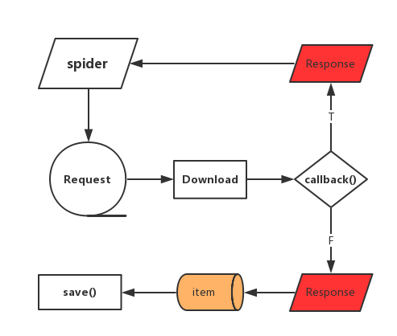

## talonspider

 [](https://pypi.python.org/pypi/talonspider/)

### 1.为什么写这个？

> 一些简单的页面，无需用比较大的框架来进行爬取，自己纯手写又比较麻烦
>
> 微爬虫框架 - 小巧、方便、练手学习

因此针对这个需求写了`talonspider`:

- 1.针对单页面的item提取 - 具体介绍点[这里](./docs/item.md)
- 2.spider模块 - 具体介绍点[这里](./docs/spider.md)

### 2.介绍&&使用



#### 使用

```shell
pip install talonspider
```

#### 2.1.item

这个模块是可以独立使用的，对于一些请求比较简单的网站（比如只需要`get`请求），单单只用这个模块就可以快速地编写出你想要的爬虫，比如(以下使用python3，python2见examples目录)：

##### 2.1.1.单页面单目标

比如要获取这个网址http://book.qidian.com/info/1004608738 的书籍信息，封面等信息，可直接这样写：

```python
import time
from talonspider import Item, TextField, AttrField
from pprint import pprint

class QidianSpider(Item):
    title = TextField(css_select='.book-info>h1>em')
    author = TextField(css_select='a.writer')
    cover = AttrField(css_select='a#bookImg>img', attr='src')

    def tal_title(self, title):
        return title

    def tal_cover(self, cover):
        return 'http:' + cover

if __name__ == '__main__':
    item_data = QidianSpider.get_item(url='http://book.qidian.com/info/1004608738')
    pprint(item_data)
```

具体见[qidian_details_by_item.py](./examples/qidian_details_by_item.py)

##### 2.1.1.单页面多目标

比如获取[豆瓣250电影]([https://movie.douban.com/top250](https://movie.douban.com/top250))首页展示的25部电影，这一个页面有25个目标，可直接这样写：

```python
from talonspider import Item, TextField, AttrField
from pprint import pprint

# 定义继承自item的Item类
class DoubanSpider(Item):
    target_item = TextField(css_select='div.item')
    title = TextField(css_select='span.title')
    cover = AttrField(css_select='div.pic>a>img', attr='src')
    abstract = TextField(css_select='span.inq')

    def tal_title(self, title):
        if isinstance(title, str):
            return title
        else:
            return ''.join([i.text.strip().replace('\xa0', '') for i in title])

if __name__ == '__main__':
    items_data = DoubanSpider.get_items(url='https://movie.douban.com/top250')
    result = []
    for item in items_data:
        result.append({
            'title': item.title,
            'cover': item.cover,
            'abstract': item.abstract,
        })
    pprint(result)
```

具体见[douban_page_by_item.py](./examples/douban_page_by_item.py)

#### 2.2.spider

当需要爬取有层次的页面时，比如爬取豆瓣250全部电影，这时候`spider`部分就派上了用场：

```python
# !/usr/bin/env python
from talonspider import Spider, Item, TextField, AttrField, Request
from talonspider.utils import get_random_user_agent


# 定义继承自item的爬虫类
class DoubanItem(Item):
    target_item = TextField(css_select='div.item')
    title = TextField(css_select='span.title')
    cover = AttrField(css_select='div.pic>a>img', attr='src')
    abstract = TextField(css_select='span.inq')

    def tal_title(self, title):
        if isinstance(title, str):
            return title
        else:
            return ''.join([i.text.strip().replace('\xa0', '') for i in title])


class DoubanSpider(Spider):
    # 定义起始url，必须
    start_urls = ['https://movie.douban.com/top250']
    # requests配置
    request_config = {
        'RETRIES': 3,
        'DELAY': 0,
        'TIMEOUT': 20
    }
	# 解析函数 必须有
    def parse(self, res):
        # 将html转化为etree
        etree = self.e_html(res.html)
        # 提取目标值生成新的url
        pages = [i.get('href') for i in etree.cssselect('.paginator>a')]
        pages.insert(0, '?start=0&filter=')
        headers = {
            "User-Agent": get_random_user_agent()
        }
        for page in pages:
            url = self.start_urls[0] + page
            yield Request(url, request_config=self.request_config, headers=headers, callback=self.parse_item)

    def parse_item(self, res):
        items_data = DoubanItem.get_items(html=res.html)
        # result = []
        for item in items_data:
            # result.append({
            #     'title': item.title,
            #     'cover': item.cover,
            #     'abstract': item.abstract,
            # })
            # 保存
            with open('douban250.txt', 'a+') as f:
                f.writelines(item.title + '\n')


if __name__ == '__main__':
    DoubanSpider.start()
```

控制台：

```shell
/Users/howie/anaconda3/envs/work3/bin/python /Users/howie/Documents/programming/python/git/talonspider/examples/douban_page_by_spider.py
2017-06-07 23:17:30,346 - talonspider - INFO: talonspider started
2017-06-07 23:17:30,693 - talonspider_requests - INFO: GET a url: https://movie.douban.com/top250
2017-06-07 23:17:31,074 - talonspider_requests - INFO: GET a url: https://movie.douban.com/top250?start=25&filter=
2017-06-07 23:17:31,416 - talonspider_requests - INFO: GET a url: https://movie.douban.com/top250?start=50&filter=
2017-06-07 23:17:31,853 - talonspider_requests - INFO: GET a url: https://movie.douban.com/top250?start=75&filter=
2017-06-07 23:17:32,523 - talonspider_requests - INFO: GET a url: https://movie.douban.com/top250?start=100&filter=
2017-06-07 23:17:33,032 - talonspider_requests - INFO: GET a url: https://movie.douban.com/top250?start=125&filter=
2017-06-07 23:17:33,537 - talonspider_requests - INFO: GET a url: https://movie.douban.com/top250?start=150&filter=
2017-06-07 23:17:33,990 - talonspider_requests - INFO: GET a url: https://movie.douban.com/top250?start=175&filter=
2017-06-07 23:17:34,406 - talonspider_requests - INFO: GET a url: https://movie.douban.com/top250?start=200&filter=
2017-06-07 23:17:34,787 - talonspider_requests - INFO: GET a url: https://movie.douban.com/top250?start=225&filter=
2017-06-07 23:17:34,809 - talonspider - INFO: Time usage：0:00:04.462108

Process finished with exit code 0
```

此时当前目录会生成`douban250.txt`，具体见[douban_page_by_spider.py](./examples/douban_page_by_spider.py)。

### 3.说明

学习之作，待完善的地方还有很多。

